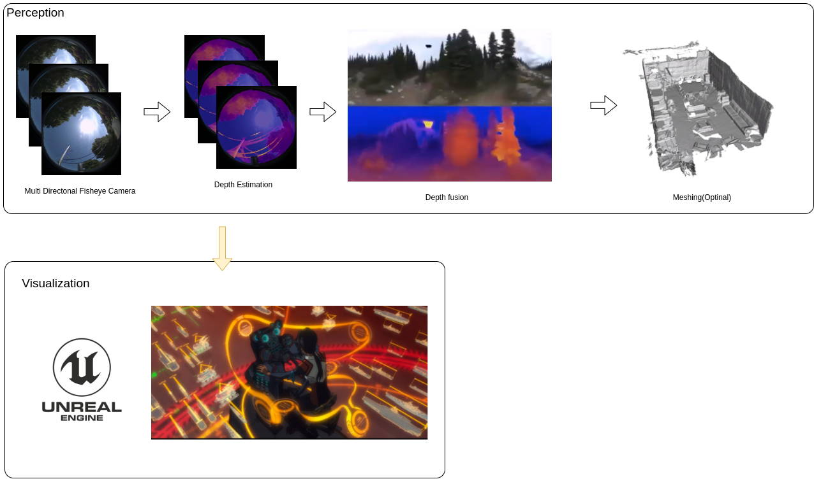

# 新操縦システムDesignDoc

## Introduction
Our goal is to create a cutting-edge graphical user interface for "The Championship of Robotics Engineers" competition, or CoRE for short.
In this competition, the robot moves in a highly dynamic, and robot pilots are restricted to a single monitor for controlling their robots, making it difficult to fully comprehend the surrounding environment and obstacles.

### Purpose
We aim to develop a user-friendly system that provides the pilot with clear situational awareness while featuring an aesthetically pleasing and modern user interface.
Additionally, we aim to deliver short-term feedback and improvement to pilots for better UX.

### References
CoRE: https://scramble-robot.org/archives/19630/

## Concept
Our system is built upon two concepts.
The first is the utilization of a game engine, which enables us to create a cool and low-latency user interface that can be rendered on an edge device.
The second concept is the implementation of 3D perceptual sensors, which allow us to reconstruct and visualize the surrounding environment in real time.

### Functional Overview
Our system is comprised of two parts. The first is the perception module which is responsible for processing the input sensor information. Once the input has been processed, it is then passed on to the visualization modules.
The visualization module is responsible for rendering the perceptual information in low latency and real-time.

### Problems to handle
Several issues may occur.

- Latency:

In a current system, there are several steps involved in processing input information before it can be rendered, leading to significant latency issues.

- 3D processing:

Many 3D sensing devices struggle to handle dense 3D points, resulting in a poor appearance for the user interface.

- Computational Resources:

Utilizing a game engine for visualization and 3D processing in the perception module requires significant computational resources, which can be a challenge for edge devices with limited processing power.

## Requirements Specification

### Functional requirements
### Non-functional requirements
### User scenarios

## System Pipeline

### Architecture/System structure
### Security/Privacy
### Testing/Quality assurance
### Scalability/Flexibility

## Implementation

### Technology stack
### Code structure
### Dependencies

## Conclusion

### Evaluation
### Future outlook
### Acknowledgements

## References